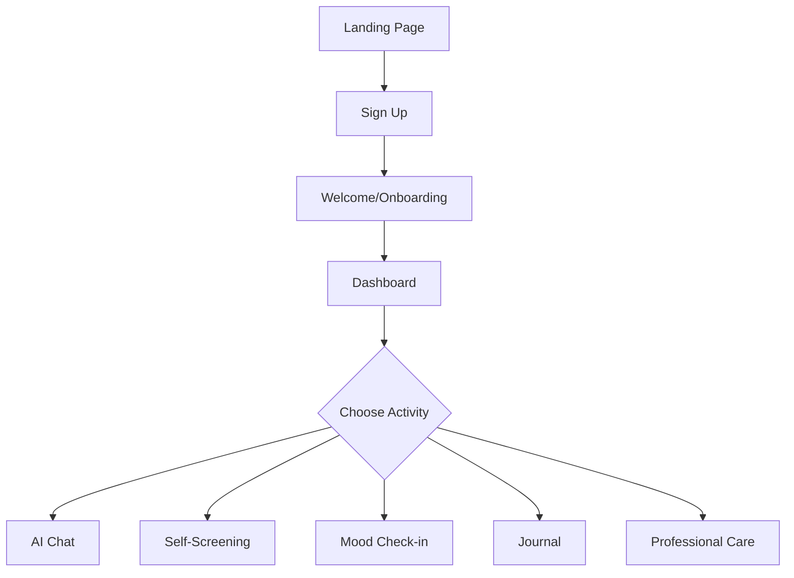
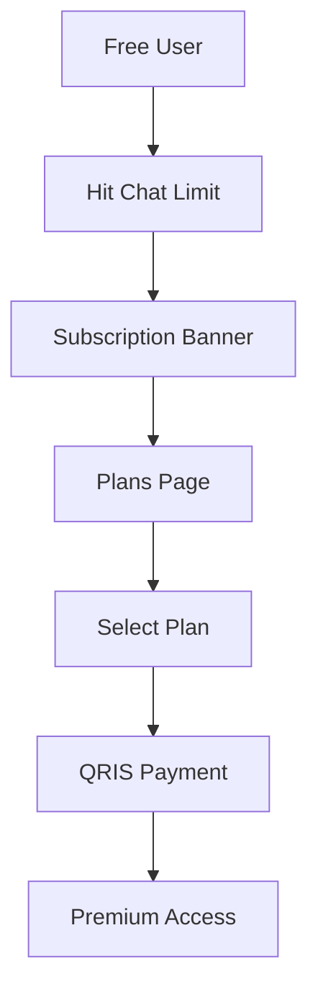
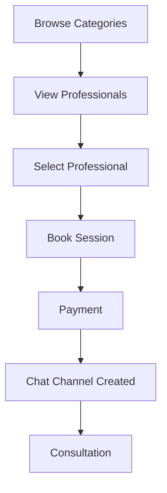

# PRD01 - Jiwo.AI Mental Wellness Platform
## Comprehensive Product Requirement Document

**Version:** 01  
**Document Type:** Deep Analysis & Technical Specification  
**Generated:** December 16, 2025  
**Migration Note:** Project migrated from previous build system to Antigravity

---

## 1. Executive Summary

### 1.1 Product Overview

**Jiwo.AI** adalah platform digital kesehatan mental berbasis web yang dibangun dengan Next.js 14. Platform ini menyediakan dukungan kesehatan mental yang komprehensif melalui:

- **AI Companion Chat** - Percakapan AI untuk dukungan emosional
- **Self-Screening Tools** - Tes PHQ-9 dan MBTI personality assessment
- **Professional Care Marketplace** - Akses ke psikolog, psikiater, life coach, dll
- **Holistic Wellness** - Yoga studio, art therapy, journaling
- **Corporate Wellness** - Dashboard HR untuk program kesehatan karyawan

### 1.2 Technical Stack

| Layer | Technology |
|-------|------------|
| **Frontend** | Next.js 14 (App Router), React 18, TypeScript |
| **Styling** | Tailwind CSS, shadcn/ui, Framer Motion |
| **Backend** | Supabase (PostgreSQL, Auth, Realtime) |
| **Payments** | Midtrans Snap, QRIS |
| **PWA** | next-pwa |
| **Deployment** | Vercel |

### 1.3 Project Statistics

| Metric | Count |
|--------|-------|
| App Routes | 12 directories |
| Components | 33 main + 45 UI components |
| Database Migrations | 44 files |
| Dependencies | 32 packages |

---

## 2. Architecture Analysis

### 2.1 Directory Structure

```
src/
├── app/                    # Next.js App Router
│   ├── api/               # 7 API endpoints
│   ├── auth/              # Authentication pages
│   ├── care/              # Professional care chat
│   ├── chat/              # Chat features
│   ├── corporate/         # Corporate wellness
│   ├── dashboard/         # User dashboards
│   ├── landing/           # Landing page
│   ├── plans/            # Subscription plans
│   ├── professionals/     # Professional listings
│   ├── relaxation/        # Relaxation content
│   └── welcome/          # Onboarding
├── components/            # React components
│   ├── ui/               # 45 shadcn/ui components
│   ├── care-chat/        # 6 chat components
│   ├── corporate/        # Corporate dashboard
│   ├── dashboard-pages/  # 5 dashboard views
│   └── payments/         # Payment components
├── lib/                   # Utilities
├── hooks/                 # Custom hooks
└── types/                 # TypeScript types
```

### 2.2 Database Schema (44 Migrations)

**Core Tables:**
- `users` - User accounts with role-based access
- `moods` - Mood tracking entries (1-5 scale)
- `journals` - Journal entries with mood tags
- `ai_chats` - AI conversation history
- `screenings` - PHQ-9 and MBTI assessment results

**Professional Care:**
- `professionals` - Professional profiles (6 categories)
- `bookings` - Session bookings with status tracking
- `sessions` - Completed sessions
- `chat_channels` - User-professional chat channels
- `care_chat_messages` - Chat messages

**Payments & Subscriptions:**
- `plans` - Subscription plans (Basic, Premium, Pro)
- `subscriptions` - User subscriptions with dates
- `payments` - Payment records with Midtrans integration

**Corporate Wellness:**
- `companies` - Company profiles
- `company_admins` - HR admin access
- `company_employees` - Employee enrollment
- `company_insights` - Aggregated analytics
- `company_alerts` - Wellness alerts

---

## 3. Feature Analysis

### 3.1 AI Chat Companion (`ai-chat.tsx`)

**File Size:** 18,081 bytes | **Lines:** 575

**Key Features:**
- Topic-based conversation selection
- Real-time typing indicators with animations
- Chat usage limits (free/premium tiers)
- Message persistence to Supabase
- Informal chat UI with glassmorphism design
- Webhook integration for AI responses

**Technical Implementation:**
```typescript
interface Message {
  id: string;
  content: string;
  sender: "user" | "ai";
  created_at: string;
}

interface ChatUsage {
  chat_count: number;
  chat_limit: number;
  is_premium: boolean;
}
```

**UI Characteristics:**
- Gradient teal background
- Fade-in animations for messages
- Typing indicator with bouncing dots
- Quick reply buttons

---

### 3.2 Self-Screening (`self-screening.tsx`)

**File Size:** 40,050 bytes | **Lines:** 981 (largest component)

**Assessment Types:**

#### A. Mental Health Screening (PHQ-9 Based)
- 5 core questions about depression symptoms
- Frequency-based responses (0-3 scale)
- Scoring categories: Minimal, Mild, Moderate, Severe
- Professional recommendations based on score

**Questions Cover:**
1. Sadness, depression, hopelessness
2. Lack of interest in activities
3. Sleep disturbances
4. Fatigue and lack of energy
5. Concentration difficulties

#### B. Personality Assessment (MBTI)
- 16 questions across 4 dimensions
- **E/I** - Extraversion vs Introversion
- **S/N** - Sensing vs Intuition
- **T/F** - Thinking vs Feeling
- **J/P** - Judging vs Perceiving

**MBTI Profiles Included:**
| Type | Name | Key Trait |
|------|------|-----------|
| INTJ | The Architect | Strategic thinker |
| ENTP | The Debater | Innovative explorer |
| INFJ | The Advocate | Idealistic inspirer |
| ENFP | The Campaigner | Creative enthusiast |
| ISTJ | The Logistician | Reliable organizer |
| ESFJ | The Consul | Caring harmonizer |
| ISTP | The Virtuoso | Practical explorer |
| ESFP | The Entertainer | Spontaneous performer |

**Each profile provides:**
- Name and description
- Key strengths (4 traits)
- Career recommendations (5 options)
- Life advice for growth

---

### 3.3 Dashboard (`dashboard.tsx`)

**File Size:** 14,322 bytes | **Lines:** 397

**Statistics Displayed:**
```typescript
interface DashboardStats {
  totalMoods: number;
  totalJournals: number;
  averageMood: number;
  recentMood: string;
  weeklyProgress: number;
}
```

**Quick Access Cards:**
- AI Chat
- Journaling
- Self-Screening
- Weekly Insights
- Professional Care
- Mood Check-in

**User Actions:**
- View personalized greeting
- Access all features
- Sign out functionality

---

### 3.4 Professional Care System

**Categories (6 types):**
1. **Psychologists** - Talk therapy specialists
2. **Psychiatrists** - Medical mental health treatment
3. **Life Coaches** - Personal development guidance
4. **Nutritionists** - Dietary wellness
5. **Yoga Instructors** - Mind-body wellness
6. **Art Therapists** - Creative expression healing

**Components:**
| Component | Size | Purpose |
|-----------|------|---------|
| `professional-care.tsx` | 7,765 bytes | Category browser |
| `professional-list.tsx` | 7,560 bytes | Professional listings |
| `professional-inbox.tsx` | 10,870 bytes | Chat inbox |
| `booking-modal.tsx` | 7,814 bytes | Session booking |

**Booking Flow:**
1. Browse professionals by category
2. View profile (experience, price, availability)
3. Book session with date/time
4. Pay via QRIS/Midtrans
5. Chat channel created after payment

---

### 3.5 Holistic Wellness Features

#### Yoga Studio (`yoga-studio.tsx`)
**File Size:** 21,786 bytes

- Video library with categories
- Postnatal yoga
- Singing bowl sessions
- Yoga Nidra (sleep yoga)
- Progress tracking

#### Art Therapy (`art-therapy.tsx`)
**File Size:** 11,787 bytes

- Creative expression tools
- Guided art exercises
- Emotional healing activities

#### Journal (`journal.tsx`)
**File Size:** 13,346 bytes

- CRUD operations for entries
- Mood tagging
- Search by tags
- Rich text support

#### Mood Check-in (`mood-checkin.tsx`)
**File Size:** 7,275 bytes

- 5-level emoji selector
- Fine-tuning slider (1-5)
- Optional notes
- Timestamp tracking

#### Weekly Insights (`weekly-insights.tsx`)
**File Size:** 14,207 bytes

- Mood trend visualization
- Activity summary
- Progress analytics
- Actionable recommendations

---

### 3.6 Payment System

**Integration:** Midtrans Snap + QRIS

**API Routes:**
| Endpoint | Purpose |
|----------|---------|
| `/api/payment/charge` | Create payment |
| `/api/payment/status` | Check status |
| `/api/payment/qris` | QRIS redirect |
| `/api/payment/webhook` | Payment callbacks |
| `/api/webhook/midtrans` | Midtrans webhook |

**Subscription Plans:**
| Plan | Price | Duration |
|------|-------|----------|
| Basic | Rp 49,000/month | 30 days |
| Premium | Rp 99,000/month | 30 days |
| Pro | Rp 149,000/month | 30 days |

**Payment Flow:**
1. User selects plan/booking
2. API creates payment record
3. Midtrans Snap token generated
4. User pays via QRIS
5. Webhook updates payment status
6. Subscription/booking activated

---

### 3.7 Corporate Wellness

**Dashboard Metrics:**
- Total employees enrolled
- Active users (weekly/monthly)
- Average mood score
- Mood trends (positive/negative/stable)
- Collective stress levels
- Engagement rate
- Department comparisons

**AI Insights for HR:**
- Team engagement alerts
- Stress pattern detection
- Department wellness recommendations
- Proactive intervention suggestions

**Privacy Features:**
- Aggregated data only (no individual tracking)
- Minimum 5 employees for department insights
- Employee opt-in required
- GDPR compliant

---

## 4. Technical Debt & Issues

### 4.1 Identified Issues

| Issue | Severity | Location |
|-------|----------|----------|
| Top-level Supabase client initialization | **Fixed** | 6 API routes |
| Stripe dependency unused | Low | package.json |
| tempo-devtools in production | Low | package.json |
| Old backup files | Low | `ai-chat-old-backup.tsx`, `landing-old/` |

### 4.2 Migration Notes

**Previous Build System Issues:**
- Environment variable access at build time
- Supabase client initialization outside functions
- **Resolution:** Moved client creation inside request handlers

**Fixed Files:**
- `src/app/api/payment/charge/route.ts`
- `src/app/api/payment/status/route.ts`
- `src/app/api/payment/webhook/route.ts`
- `src/app/api/payment/mock-complete/route.ts`
- `src/app/api/payment/test-success/route.ts`
- `src/app/api/webhook/midtrans/route.ts`

---

## 5. Environment Configuration

### 5.1 Required Variables

```bash
# Supabase
NEXT_PUBLIC_SUPABASE_URL=
NEXT_PUBLIC_SUPABASE_ANON_KEY=
SUPABASE_SERVICE_KEY=
SUPABASE_PROJECT_ID=

# Midtrans
MIDTRANS_SERVER_KEY=
NEXT_PUBLIC_MIDTRANS_CLIENT_KEY=
MIDTRANS_API_URL=

# Application
NEXT_PUBLIC_APP_URL=
```

### 5.2 Deployment

**Target Platform:** Vercel

**Build Command:** `npm run build`
**Dev Command:** `npm run dev`

**PWA Configuration:** Enabled via `next-pwa`

---

## 6. User Flows

### 6.1 New User Journey



### 6.2 Premium Conversion



### 6.3 Professional Booking



---

## 7. API Reference

### 7.1 Payment Endpoints

#### POST `/api/payment/charge`
**Request:**
```json
{
  "user_id": "uuid",
  "amount": 99000,
  "payment_type": "subscription",
  "metadata": {
    "plan_id": "uuid"
  }
}
```

**Response:**
```json
{
  "success": true,
  "snap_token": "token",
  "redirect_url": "url",
  "ref_code": "RUANG-SUBSCRIPTION-xxx",
  "payment_id": "uuid"
}
```

#### GET `/api/payment/status?ref_code=xxx`
**Response:**
```json
{
  "success": true,
  "payment": {
    "id": "uuid",
    "status": "paid",
    "amount": 99000
  }
}
```

---

## 8. Component Dependencies

### 8.1 UI Components (shadcn/ui)

Total: **45 components** in `src/components/ui/`

**Core:** Button, Card, Input, Label, Textarea
**Layout:** Tabs, Dialog, Sheet, Drawer, Accordion
**Data Display:** Table, Badge, Avatar, Progress
**Navigation:** Navigation Menu, Dropdown Menu, Command
**Feedback:** Toast, Alert, Skeleton
**Forms:** Form, Checkbox, Radio Group, Select, Switch

### 8.2 External Dependencies

| Package | Version | Purpose |
|---------|---------|---------|
| `next` | 14.2.23 | Framework |
| `react` | ^18 | UI Library |
| `@supabase/supabase-js` | latest | Backend |
| `framer-motion` | ^12.23.24 | Animations |
| `lucide-react` | ^0.468.0 | Icons |
| `next-pwa` | ^5.6.0 | PWA Support |
| `qrcode.react` | ^4.2.0 | QR Generation |
| `date-fns` | ^4.1.0 | Date Utils |

---

## 9. Future Recommendations

### 9.1 Short-term (1-2 weeks)
- [ ] Remove unused `stripe` dependency
- [ ] Clean up backup files (`ai-chat-old-backup.tsx`, `landing-old/`)
- [ ] Remove `tempo-devtools` from production build
- [ ] Add error boundary components
- [ ] Implement proper loading states

### 9.2 Medium-term (1 month)
- [ ] Add unit tests for API routes
- [ ] Implement caching with React Query/SWR
- [ ] Add Sentry for error monitoring
- [ ] Optimize bundle size
- [ ] Add rate limiting

### 9.3 Long-term (3 months)
- [ ] Video call integration for sessions
- [ ] Mobile native apps (React Native)
- [ ] Multi-language support (EN/ID)
- [ ] Advanced AI with context memory
- [ ] Integration with HR systems

---

## 10. Appendices

### A. File Size Analysis (Top 10)

| File | Size | Lines |
|------|------|-------|
| `self-screening.tsx` | 40,050 bytes | 981 |
| `yoga-studio.tsx` | 21,786 bytes | - |
| `ai-chat.tsx` | 18,081 bytes | 575 |
| `ai-chat-old-backup.tsx` | 16,869 bytes | - |
| `dashboard.tsx` | 14,322 bytes | 397 |
| `weekly-insights.tsx` | 14,207 bytes | - |
| `journal.tsx` | 13,346 bytes | - |
| `qris-subscription.tsx` | 11,856 bytes | - |
| `art-therapy.tsx` | 11,787 bytes | - |
| `professional-inbox.tsx` | 10,870 bytes | - |

### B. Database Migration Timeline

- **20240101** - Initial users table
- **20240322** - Core tables (moods, journals, etc.)
- **20240323** - Care chat system
- **20240404** - Payment tables
- **20240413** - Corporate wellness tables
- **20240420** - Complete schema consolidation
- **20240430** - Midtrans Snap integration

### C. Glossary

| Term | Definition |
|------|------------|
| **PHQ-9** | Patient Health Questionnaire (9-item depression screening) |
| **MBTI** | Myers-Briggs Type Indicator |
| **QRIS** | Quick Response Code Indonesian Standard |
| **RLS** | Row Level Security (Supabase) |
| **PWA** | Progressive Web App |
| **SSR** | Server-Side Rendering |

---

**Document Version:** 01  
**Last Updated:** December 16, 2025  
**Author:** Antigravity Analysis System
