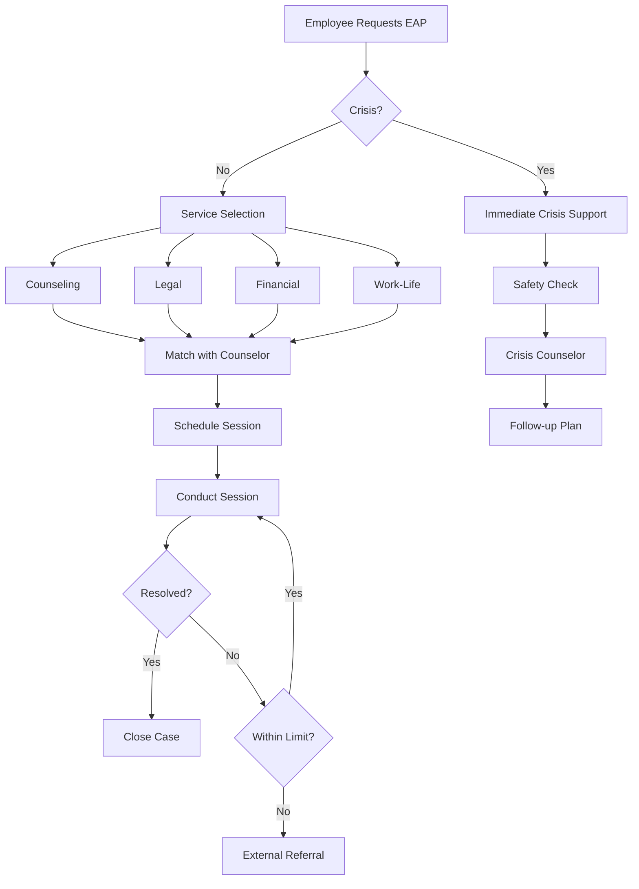

# PRD02 - Employee Assistance Program (EAP)
## Jiwo.AI Corporate Wellness Enhancement

**Version:** 02  
**Document Type:** Feature Specification - EAP Integration  
**Generated:** December 16, 2025  
**Status:** Proposed  

---

## 1. Executive Summary

### 1.1 Overview

Dokumen ini mendefinisikan **Employee Assistance Program (EAP)** sebagai ekstensi dari Corporate Wellness yang sudah ada di Jiwo.AI. EAP menyediakan dukungan komprehensif untuk karyawan yang menghadapi masalah pribadi atau pekerjaan yang dapat mempengaruhi kesehatan mental, produktivitas, dan kesejahteraan.

### 1.2 Value Proposition

| Stakeholder | Benefit |
|-------------|---------|
| **Karyawan** | Akses 24/7 ke dukungan profesional, confidential support |
| **HR/Perusahaan** | Reduced absenteeism, improved productivity, lower turnover |
| **Jiwo.AI** | New revenue stream, enterprise market expansion |

### 1.3 Integration with Existing Features

```
┌─────────────────────────────────────────────────────────────┐
│                    JIWO CORPORATE PLATFORM                   │
├─────────────────────────────────────────────────────────────┤
│  ┌─────────────────┐    ┌─────────────────────────────────┐ │
│  │ CORPORATE       │    │ EMPLOYEE ASSISTANCE PROGRAM     │ │
│  │ WELLNESS        │ ←→ │ (NEW)                           │ │
│  │ (Existing)      │    │                                 │ │
│  │                 │    │ • Crisis Hotline                │ │
│  │ • HR Dashboard  │    │ • Legal Consultation            │ │
│  │ • Mood Analytics│    │ • Financial Counseling          │ │
│  │ • Stress Alerts │    │ • Work-Life Balance             │ │
│  │ • Engagement    │    │ • Manager Support               │ │
│  └─────────────────┘    │ • Critical Incident Response    │ │
│                         └─────────────────────────────────┘ │
└─────────────────────────────────────────────────────────────┘
```

---

## 2. EAP Core Features

### 2.1 Crisis Support & Hotline

**24/7 Emergency Support**

| Service | Availability | Response Time |
|---------|--------------|---------------|
| Chat Crisis | 24/7 | < 5 minutes |
| Phone Hotline | 24/7 | Immediate |
| Video Emergency | 6AM-12AM | < 15 minutes |

**Crisis Categories:**
- 🔴 **Suicidal ideation** - Immediate professional transfer
- 🟠 **Severe anxiety/panic** - Priority queue
- 🟡 **Work crisis** - Same-day support
- 🟢 **General stress** - Scheduled support

**Implementation:**
```typescript
interface CrisisRequest {
  user_id: string;
  severity: 'critical' | 'high' | 'medium' | 'low';
  category: 'mental_health' | 'work' | 'personal' | 'financial';
  description?: string;
  requires_callback: boolean;
  preferred_contact: 'chat' | 'phone' | 'video';
}
```

---

### 2.2 Multi-Domain Professional Support

#### A. Mental Health Counseling (Enhanced)
- Short-term counseling (6-8 sessions)
- Referral to long-term care
- Trauma-informed support
- Substance abuse support

#### B. Legal Consultation (NEW)
- Family law (divorce, custody)
- Employment law
- Consumer rights
- Immigration matters
- Will & estate planning

#### C. Financial Counseling (NEW)
- Debt management
- Budgeting assistance
- Retirement planning
- Tax guidance
- Financial crisis support

#### D. Work-Life Balance (NEW)
- Childcare resources
- Eldercare support
- Maternity/paternity guidance
- Relocation assistance
- Career development

**Database Schema Addition:**
```sql
CREATE TABLE eap_services (
  id UUID PRIMARY KEY,
  category TEXT NOT NULL, -- 'mental_health', 'legal', 'financial', 'work_life'
  service_name TEXT,
  description TEXT,
  session_limit INTEGER,
  is_active BOOLEAN DEFAULT true,
  created_at TIMESTAMPTZ DEFAULT NOW()
);

CREATE TABLE eap_consultations (
  id UUID PRIMARY KEY,
  user_id UUID REFERENCES users(id),
  company_id UUID REFERENCES companies(id),
  service_id UUID REFERENCES eap_services(id),
  professional_id UUID REFERENCES professionals(id),
  status TEXT DEFAULT 'scheduled', -- 'scheduled', 'completed', 'cancelled', 'no_show'
  session_type TEXT, -- 'chat', 'phone', 'video', 'in_person'
  scheduled_at TIMESTAMPTZ,
  duration_minutes INTEGER,
  notes TEXT, -- encrypted, professional only
  satisfaction_rating INTEGER,
  is_confidential BOOLEAN DEFAULT true,
  created_at TIMESTAMPTZ DEFAULT NOW()
);

CREATE TABLE eap_referrals (
  id UUID PRIMARY KEY,
  consultation_id UUID REFERENCES eap_consultations(id),
  referral_type TEXT, -- 'internal', 'external'
  provider_name TEXT,
  provider_contact TEXT,
  reason TEXT,
  is_accepted BOOLEAN,
  created_at TIMESTAMPTZ DEFAULT NOW()
);
```

---

### 2.3 Manager Assistance Program (MAP)

**Support for Leaders:**

| Feature | Description |
|---------|-------------|
| **Consultation** | Guide managers on supporting struggling employees |
| **Difficult Conversations** | Training for performance/mental health talks |
| **Team Dynamics** | Mediation and conflict resolution |
| **Return-to-Work** | Support for employees returning from leave |
| **Critical Incidents** | On-site support after workplace trauma |

**Use Cases:**
- Manager notices employee behavioral changes
- Team conflict affecting productivity
- Employee disclosure of mental health issue
- Post-layoff team support
- Workplace harassment situations

---

### 2.4 Critical Incident Response

**Trauma Support Services:**

```
┌───────────────────────────────────────────────────────────┐
│                CRITICAL INCIDENT PROTOCOL                  │
├───────────────────────────────────────────────────────────┤
│  TRIGGER EVENTS:                                          │
│  • Workplace accident or death                            │
│  • Natural disaster                                       │
│  • Violence or threat                                     │
│  • Sudden loss of colleague                               │
│  • Major organizational change (layoffs)                  │
├───────────────────────────────────────────────────────────┤
│  RESPONSE TIMELINE:                                       │
│  0-2 hours  → On-call counselor activated                │
│  2-24 hours → Defusing session (small groups)            │
│  24-72 hours → Critical Incident Stress Debriefing       │
│  1-4 weeks  → Follow-up support and monitoring           │
│  Ongoing    → Long-term counseling referrals             │
└───────────────────────────────────────────────────────────┘
```

---

### 2.5 Self-Help Resource Library

**Digital Content Types:**

| Category | Content Format | Examples |
|----------|---------------|----------|
| **Articles** | Written guides | "Managing Work Stress", "Financial Planning 101" |
| **Videos** | Short tutorials | Mindfulness exercises, conflict resolution |
| **Webinars** | Live/recorded | Monthly wellness topics |
| **Assessments** | Interactive | Stress check, burnout risk |
| **Toolkits** | Downloadable | Budget templates, sleep hygiene checklist |
| **Podcasts** | Audio | Expert interviews, success stories |

---

## 3. Program Recommendations

### 3.1 Additional Corporate Wellness Programs

Berdasarkan analisis tren industri dan kebutuhan perusahaan Indonesia, berikut program tambahan yang direkomendasikan:

---

#### A. 🏃 Physical Wellness Program

**Features:**
- Step challenges (individual & team)
- Virtual fitness classes
- Gym membership subsidies
- Health risk assessment
- Biometric screening integration

**Gamification:**
- Leaderboards
- Badges & achievements
- Reward points redeemable for merchandise

**Integration:**
```typescript
interface WellnessChallenge {
  id: string;
  type: 'steps' | 'exercise' | 'sleep' | 'nutrition';
  target: number;
  duration_days: number;
  participants: string[];
  prizes: Prize[];
}
```

---

#### B. 🧘 Mindfulness & Meditation Program

**Content Library:**
- Guided meditation (5-30 min)
- Breathing exercises
- Body scan relaxation
- Sleep stories
- Focus music

**Features:**
- Daily meditation reminders
- Streak tracking
- Manager-led group sessions
- Integration with mood tracking

---

#### C. 💰 Financial Wellness Program

**Educational Content:**
- Budgeting basics
- Emergency fund building
- Debt management
- Retirement planning (BPJS/JP)
- Investment fundamentals

**Tools:**
- Salary advance request
- Budget calculator
- Financial health score
- Goal tracking

---

#### D. 📚 Learning & Development Integration

**Career Wellness:**
- Skills assessment
- Learning path recommendations
- Mentorship matching
- Career transition support
- Performance coaching

**Mental Health + Career:**
- Imposter syndrome support
- Public speaking anxiety
- Leadership stress management

---

#### E. 🏠 Remote Work Wellness

**Hybrid/Remote Support:**
- Ergonomic workspace assessment
- Virtual watercooler (social connection)
- Boundary-setting tools
- Async communication training
- Digital detox reminders

---

#### F. 👨‍👩‍👧 Family Support Program

**Comprehensive Family Care:**
- Parenting resources
- Childcare finder
- Eldercare support
- Family counseling
- Fertility & pregnancy support
- Adoption resources

---

#### G. 🌿 Burnout Prevention Program

**Proactive Approach:**

| Feature | Description |
|---------|-------------|
| **Burnout Risk Assessment** | Monthly micro-survey (2-3 questions) |
| **Workload Analysis** | Meeting hours, after-hours emails |
| **Recovery Metrics** | PTO usage, weekend login patterns |
| **Manager Alerts** | Team-level burnout indicators |
| **Intervention Prompts** | AI-suggested breaks, boundary reminders |

---

#### H. 🤝 Peer Support Network

**Employee-to-Employee Support:**
- Trained peer listeners
- Support groups (anxiety, new parents, grief)
- Buddy system for new employees
- Recovery support community
- ERG (Employee Resource Group) integration

---

#### I. 🏆 Recognition & Appreciation

**Positive Psychology Integration:**
- Peer recognition wall
- Gratitude journaling
- Milestone celebrations
- Random acts of kindness challenges
- Values-based recognition

---

### 3.2 Recommended Implementation Roadmap

| Phase | Timeline | Programs |
|-------|----------|----------|
| **Phase 1** | Q1 2025 | EAP Core (Crisis + Counseling + Legal + Financial) |
| **Phase 2** | Q2 2025 | Mindfulness Program + Physical Wellness |
| **Phase 3** | Q3 2025 | Financial Wellness Tools + Family Support |
| **Phase 4** | Q4 2025 | Burnout Prevention + Peer Support Network |
| **Phase 5** | Q1 2026 | Full Integration + Advanced Analytics |

---

## 4. Technical Specifications

### 4.1 New Components Required

| Component | Purpose | Estimated Size |
|-----------|---------|----------------|
| `eap-dashboard.tsx` | EAP service overview | ~15KB |
| `crisis-chat.tsx` | 24/7 crisis support chat | ~12KB |
| `legal-consultation.tsx` | Legal service booking | ~8KB |
| `financial-counseling.tsx` | Financial advisor access | ~8KB |
| `resource-library.tsx` | Self-help content hub | ~10KB |
| `manager-support.tsx` | MAP interface | ~8KB |
| `peer-network.tsx` | Peer support groups | ~10KB |

### 4.2 API Endpoints

```
POST   /api/eap/crisis          # Emergency request
POST   /api/eap/consultation    # Book consultation
GET    /api/eap/services        # Available services
GET    /api/eap/resources       # Resource library
POST   /api/eap/referral        # Create referral
GET    /api/eap/usage           # Company usage stats
POST   /api/eap/feedback        # Session feedback
```

### 4.3 Privacy & Confidentiality

**Data Protection:**
```typescript
interface EAPPrivacyRules {
  // HR cannot see individual EAP usage
  hr_visibility: 'aggregate_only';
  
  // Session notes are encrypted
  notes_encryption: 'AES-256';
  
  // User can request data deletion
  gdpr_compliant: true;
  
  // Separate database for sensitive data
  data_isolation: true;
  
  // Access audit logging
  access_logging: true;
}
```

**What HR CAN See:**
- Total EAP utilization rate
- Service category breakdown (not individuals)
- Average satisfaction scores
- ROI metrics

**What HR CANNOT See:**
- Who used EAP
- Individual session details
- Specific issues discussed
- Crisis request details

---

## 5. Pricing Model

### 5.1 EAP Subscription Tiers

| Tier | Price/Employee/Month | Features |
|------|---------------------|----------|
| **EAP Basic** | Rp 35,000 | 3 counseling sessions, crisis support, resource library |
| **EAP Plus** | Rp 55,000 | 6 sessions, + legal & financial consultation |
| **EAP Premium** | Rp 85,000 | Unlimited sessions, all services, manager support |
| **EAP Enterprise** | Custom | Full suite + critical incident response, on-site support |

### 5.2 Minimum Requirements

| Tier | Min Employees | Commitment |
|------|--------------|------------|
| Basic | 20 | 6 months |
| Plus | 50 | 12 months |
| Premium | 100 | 12 months |
| Enterprise | 500+ | 24 months |

---

## 6. Success Metrics

### 6.1 Key Performance Indicators

| Metric | Target | Measurement |
|--------|--------|-------------|
| **Utilization Rate** | >8% | Active users / Total employees |
| **Crisis Response Time** | <5 min | Avg time to first response |
| **Session Completion** | >85% | Completed / Scheduled sessions |
| **Satisfaction Score** | >4.2/5 | Post-session survey |
| **Resolution Rate** | >70% | Issues resolved within EAP |
| **ROI** | 3:1 | Cost savings / Program cost |

### 6.2 Business Impact Metrics

| Metric | Expected Improvement |
|--------|---------------------|
| Absenteeism | ↓ 25% |
| Presenteeism | ↓ 20% |
| Employee Turnover | ↓ 15% |
| Healthcare Claims | ↓ 10% |
| Productivity | ↑ 12% |
| Employee Engagement | ↑ 18% |

---

## 7. Competitive Analysis

### 7.1 EAP Providers in Indonesia

| Provider | Strength | Weakness |
|----------|----------|----------|
| **Talenta/Mekari** | HRIS integration | Limited wellness |
| **LifeWorks** | Global coverage | Expensive, less local |
| **Employee Matters** | Local expertise | No digital platform |
| **Prudential EAP** | Insurance bundle | Mental health focus only |

### 7.2 Jiwo.AI Competitive Advantages

✅ **Already integrated** with corporate wellness dashboard  
✅ **AI-powered** insights and recommendations  
✅ **Indonesian-first** design and language  
✅ **Mobile-friendly** PWA platform  
✅ **Holistic approach** (mental + physical + financial)  
✅ **Scalable pricing** for SMEs to enterprises  

---

## 8. Implementation Considerations

### 8.1 Legal & Compliance

- [ ] BPJS integration for referrals
- [ ] Indonesian labor law compliance
- [ ] Data privacy regulations (PP 71/2019)
- [ ] Professional licensing verification
- [ ] Insurance liability coverage

### 8.2 Localization

- [ ] Bahasa Indonesia primary
- [ ] Regional dialect support (Javanese, Sundanese)
- [ ] Cultural sensitivity training for counselors
- [ ] Islamic counseling option (Ramadan support)
- [ ] Local emergency contacts database

### 8.3 Quality Assurance

- [ ] Counselor credential verification
- [ ] Regular supervision for counselors
- [ ] Clinical outcome tracking
- [ ] Service quality audits
- [ ] User feedback integration

---

## 9. Next Steps

### Immediate Actions (Week 1-2)

1. [ ] Validate EAP requirements with 3-5 potential corporate clients
2. [ ] Identify legal and financial counselor partners
3. [ ] Design database schema extensions
4. [ ] Create wireframes for EAP components
5. [ ] Estimate development effort

### Short-term (Month 1-2)

1. [ ] Develop EAP core features (crisis, counseling)
2. [ ] Integrate with existing corporate dashboard
3. [ ] Pilot with 1-2 companies
4. [ ] Gather feedback and iterate

### Medium-term (Month 3-6)

1. [ ] Add legal and financial services
2. [ ] Launch resource library
3. [ ] Implement manager support program
4. [ ] Scale to 10+ companies

---

## Appendix

### A. EAP Session Flow



### B. Regional Emergency Contacts

| Region | Crisis Hotline | Operating Hours |
|--------|---------------|-----------------|
| Jakarta | 119 ext 8 | 24/7 |
| Surabaya | (031) 567-5000 | 24/7 |
| Bandung | (022) 6000-911 | 24/7 |
| National | Into The Light: 021-7884-5555 | 24/7 |

### C. Glossary

| Term | Definition |
|------|------------|
| **EAP** | Employee Assistance Program |
| **MAP** | Manager Assistance Program |
| **CISD** | Critical Incident Stress Debriefing |
| **Short-term Counseling** | 1-8 sessions focused on specific issue |
| **Utilization Rate** | Percentage of employees using EAP |
| **Presenteeism** | Working while sick/unproductive |

---

**Document Version:** 02  
**Last Updated:** December 16, 2025  
**Author:** Jiwo.AI Product Team
